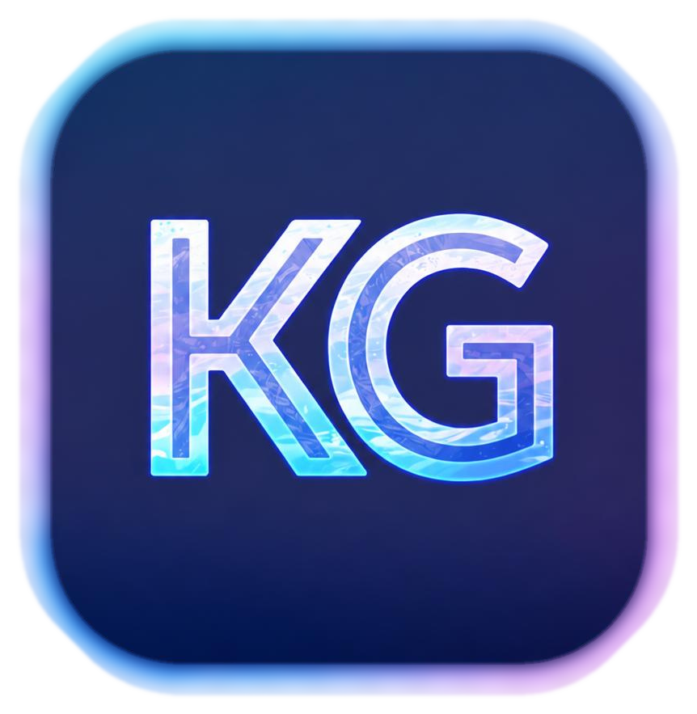

# 🎮 K GAME TRACKER (KG Tracker)

<p align="center">
  
</p>

<p align="center">
  <strong>Centro de control de escritorio para rastrear, centralizar y reclamar videojuegos gratuitos por tiempo limitado para PC.</strong>
</p>

<p align="center">
  
  
  
  
  
</p>

---

## 📌 ¿Qué es KG Tracker?

**KG Tracker** es una aplicación de escritorio nativa para Windows desarrollada en **Python** y **PySide6 (Qt 6)**. Su objetivo es mantener a los jugadores informados sobre todas las ofertas de juegos 100% gratuitos y por tiempo limitado en las principales tiendas digitales de PC, evitando el ruido de DLCs, demos, pases de temporada o bandas sonoras.

Cuenta con un motor de enriquecimiento de datos en tiempo real que cruza cada oferta con las **reseñas comunitarias de Steam** y traduce las descripciones dinámicamente en segundo plano.

---

## ✨ Características Principales

* 🌐 **Rastreo Multitienda Centralizado:** Monitorea ofertas de Epic Games, Steam, GOG, Amazon Prime Gaming, Itch.io, Humble Store, Fanatical e IndieGala mediante la API de GamerPower.
* 🧹 **Filtrado Inteligente:** Elimina automáticamente expansiones, skins, demos, betas y contenido secundario, mostrando exclusivamente videojuegos completos.
* 🎮 **Cruce con Steam API en Vivo:** Muestra la puntuación comunitaria y el porcentaje de críticas positivas de Steam (ej. `★ Steam: 95% (Muy positivas)`) incluso en ofertas regaladas por Epic Games, GOG o Prime Gaming.
* 🌍 **Traductor Dinámico de Descripciones:** Motor asíncrono con fallback multicanal (Google Mobile Web + MyMemory) que traduce las descripciones en segundo plano sin congelar la app.
* 🌐 **Internacionalización Completa (i18n):** Soporte bilingüe en caliente (Español / English) para botones, estados, modales, menús contextuales y notificaciones.
* ⚡ **Arquitectura de Alto Rendimiento (60 FPS):** Carga y renderizado asíncrono de carátulas (`QThreadPool` + `QRunnable`) con caché multinivel en RAM y disco para un scroll sedoso.
* 🔔 **Integración con System Tray de Windows:** Minimiza al área de notificación junto al reloj con globos push nativos bilingües y temporizador de barrido periódico configurable (2h, 4h, 8h, 24h).
* 💰 **Historial de Reclamados y Ahorro:** Guarda localmente con I/O atómico seguro tus juegos obtenidos y calcula el valor total acumulado en dólares (`$ AHORRADO`).
* 🎵 **Música Chillout Integrada:** Hilo musical de fondo con transiciones algorítmicas suaves (*Fade Out* al minimizar, *Fade In* al restaurar).

---

## 🛠️ Stack Tecnológico

| Componente | Tecnología |
| :--- | :--- |
| **Lenguaje** | Python 3.14 |
| **Interfaz Gráfica (GUI)** | PySide6 (Qt 6.x) con hojas de estilo dinámicas (QSS) |
| **Procesamiento de Assets** | Pillow (`PIL`) |
| **Consumo de APIs y Red** | `requests` con manejo de sesiones concurrentes |
| **Motor de Audio** | `pygame-ce` |
| **Persistencia** | JSON transaccional con escritura atómica (`fsync` + reemplazo seguro) |

---

## 📁 Estructura del Proyecto

```text
KG TRACKER/
├── assets/                  # Iconografía, logotipos y carátulas
├── core/
│   ├── autostart.py         # Control opt-in de inicio con Windows
│   ├── i18n.py              # Motor central de traducciones bilingüe
│   ├── image_loader.py      # Gestor asíncrono de miniaturas y caché
│   ├── steam_enricher.py    # Cliente API de Steam para reseñas y valoraciones
│   ├── storage.py           # Persistencia atómica segura
│   ├── translator.py        # Cola de traducción de descripciones
│   └── tray.py              # Integración con la bandeja del sistema y push
├── data/                    # Historial de reclamados y ajustes
├── ui/
│   ├── game_card.py         # Tarjeta interactiva de juego y botones personalizados
│   ├── main_window.py       # Ventana principal orquestadora
│   ├── main_window_*.py     # Módulos especializados (tema, navegación, audio...)
│   └── settings_modal.py    # Modal de configuración en caliente
├── CHANGELOG.md             # Historial sincronizado de versiones
├── config.py                # Paletas de color y constantes globales
├── main.py                  # Punto de entrada y pantalla splash
└── requirements.txt         # Dependencias deterministas del entorno
```

---

## 🚀 Instalación y Puesta en Marcha

### Prerrequisitos
* **Windows 10** o **Windows 11**
* **Python 3.10 o superior** (Recomendado: Python 3.12 - 3.14)

### Pasos
1. **Clonar el repositorio:**
   ```bash
   git clone https://github.com/Kgamesdev/KG-TRACKER.git
   cd KG-TRACKER
   ```

2. **Crear y activar un entorno virtual:**
   ```powershell
   python -m venv .venv
   .\.venv\Scripts\Activate.ps1
   ```

3. **Instalar dependencias:**
   ```powershell
   pip install -r requirements.txt
   ```

4. **Ejecutar la aplicación:**
   ```powershell
   python main.py
   ```

---

## ☕ Apoyo al Proyecto

KG Tracker es software libre desarrollado y mantenido con dedicación. Si te resulta útil para ampliar tu biblioteca de juegos:

[](https://ko-fi.com)

---

## 📄 Licencia

Este proyecto está bajo la licencia **MIT**. Consulta el archivo [LICENSE](LICENSE) para más información.
